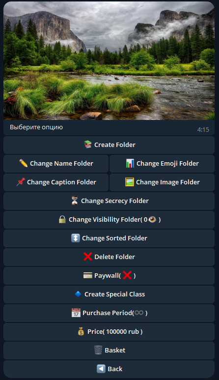
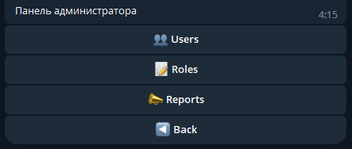
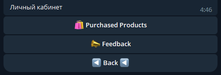

# laravel-telegram-sdk_v2
## Описание:
Конструктор создания телеграм ботов для продажи товаров или предоставления временного доступа.
Имеет панель администратора, личный кабинет пользователя, функционал настройки товара, настроки корзины товаров(цена, время аренды, указание валюты).

**Расположение проекта** ```App\Http\TelegramBot```
## Технологии:
- **php**: 8.2.8
- **Laravel**: 10.10
- **telegram-bot-sdk**: dev-develop
## Основные термины:
- **Папка** - может содержать контент и являться продуктом или быть продуктовой корзиной для других папок при покупке. 
- **Продукт** - это папка, при покупке которой, пользователь получает доступ ко всем папкам, что были в корзине товаров продукта.
- **Продуктовая корзина** - папки, связанные с продуктом, при покупке которого, они становятся доступны.
- **Рекурсия папок** - каждая папка имеет запись в базе данных и родителя за счет чего достигается иерархическая система и появляется возможность создавать бесконечное кол-во вложенных папок.
- **Область видимости** - у каждой роли есть своя настраиваемая область видимости, как и у папок. Если область видимости пользователя меньше, чем у папки, то папка будет скрыта от пользователя или заблокирована(зависит от настроек папки).
- **Специальный класс** - особый класс, область применение которого не подходит для настроек обычного класса или рекурсивного(оплата товара).
## Настройки папок:
- Создание папки.
- Изменение имени папки.
- Изменение описания папки.
- Изменение иконки папки.
- Изменение изображения папки.
- Установка отложенного времени публикации папки.
- Изменение области видимости папок для пользователей с разным уровнем доступ.
- Изменение порядка сортировки папок.
- Удаление папки.
- Сделать папку доступной только при покупке.
- Создать специальный класс.

  

## Панель администратора:
- Список пользователей с поиском по tg-id.
    - Изменение роли пользователя.
    - Добавление товара пользователю.
    - Написать пользователю в чат.
    - Заблокировать пользователя.
- Создание, удаление, редактирование имени и области видимости роли.
- Список обращений от пользователей(видны всем с должностью администратора).

 

## Личный кабинет:
- Список купленных товаров.
- Обращение к администратору.
- Ответы от администратора.



## Installation:
1. ```git clone https://github.com/LeorlikK/laravel-telegram-sdk_v2.git```
2. ```composer install```
3. Создать файл ```.env``` и скопировать в него ```.env.example```
4. Настроить ```DB_CONNECTION``` и ```REDIS_HOST```
5. Указать ```TELEGRAM_BOT_TOKEN``` и ```YOOKASSA_PROVIDER_TOKEN```
6. Указать данные администратора ```ADMIN_TG_ID```
7. ```php artisan migrate --seed```
### long polling
8. ```php artisan tg:hook_v2``` и ```php artisan queue:work```
#### ***OR***
### webhook
8. ```https://api.telegram.org/botYOUR_BOT_TOKEN/setWebhook?url=YOUR_URL```
9. telegram command```/start```

